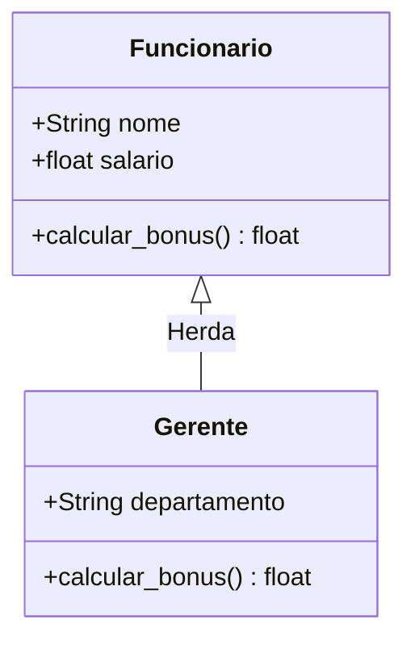

## 📐 Diagrama de Classes

```mermaid
classDiagram
    class Funcionario {
        +String nome
        +float salario
        +calcular_bonus() float
    }
    class Gerente {
        +String departamento
        +calcular_bonus() float
    }
    Funcionario <|-- Gerente : Herda
```
